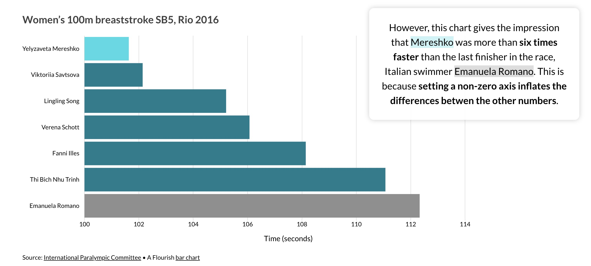
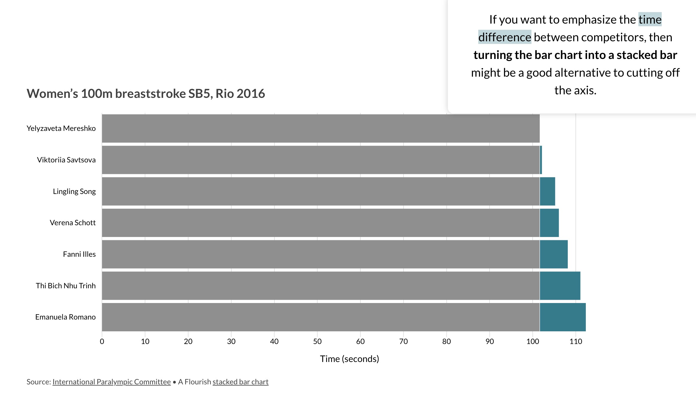

# Common Data Visualization Mistakes

## 1. Misleading color contrast
Although using various colors aids in interpreting data visualizations, too much color can confuse the user. 
It’s crucial to stick to a limited number of unique colors.

- Solution
  - The simplest way to determine contrast value is to compare contrast colors on greyscale to check if the color you choose displays the difference.
    

## 2. Overwhelming charts with too much data

- Solution
  - Do not put all of your insights into a chart. Multiple visualizations can help you communicate data more effectively.
  - It is recommended that no more than 5–6 colors be used in a single visualization.

## 3. Omitting baseline and truncating scale

- Solution
  - Concentrate on creating data visualizations with a zero-baseline y-axis.
  - If removing the zero makes sense, add a zero-break to communicate that.
    

## References
1. [Four data visualization mistakes you’re probably making and how to fix them](https://flourish.studio/blog/common-mistakes-in-data-visualization/)
2. [Numbers Shouldn't Lie: An Overview of Common Data Visualization Mistakes](https://www.toptal.com/designers/ux/data-visualization-mistakes)
3. [How to Choose the Right Data Visualization](https://chartio.com/learn/charts/how-to-choose-data-visualization/)
4. [Tutorial 4: An Introduction to Data Visualization](https://careerfoundry.com/en/tutorials/data-analytics-for-beginners/introduction-to-data-visualization/)