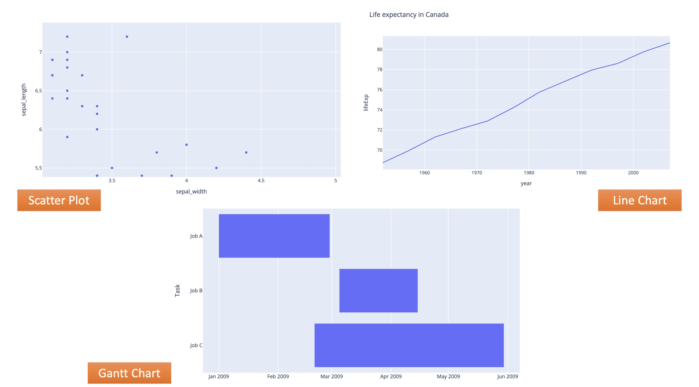
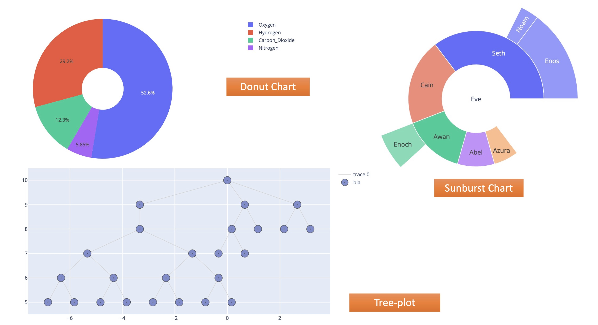
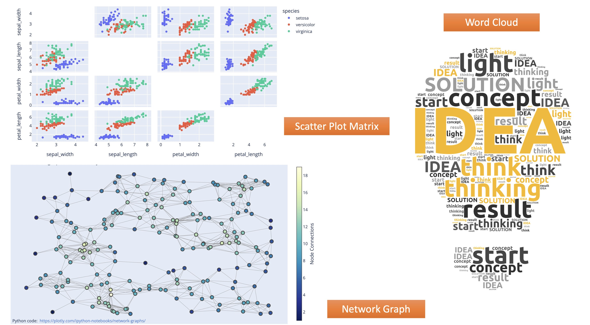
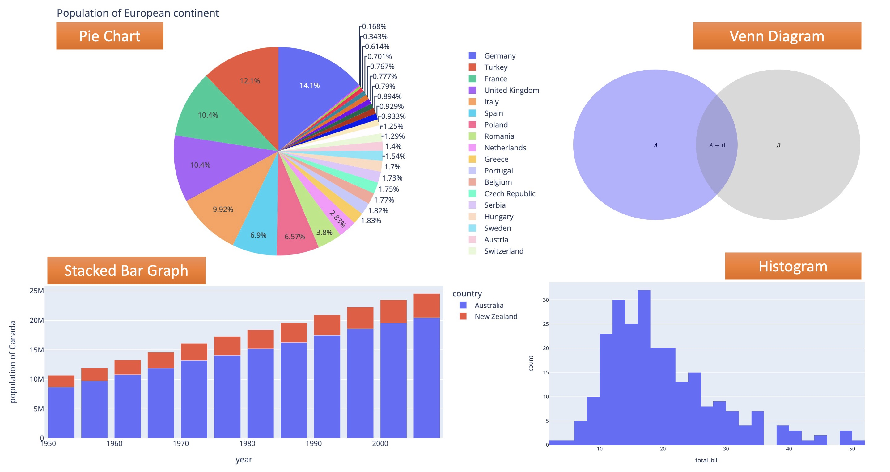
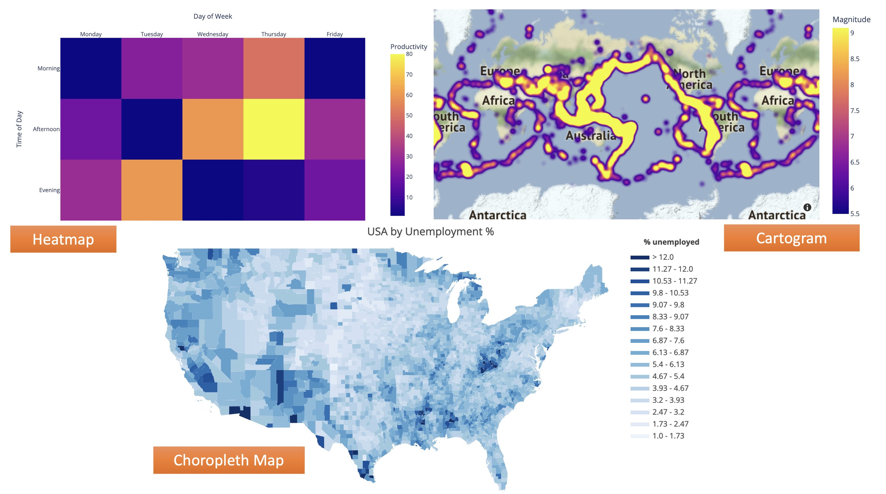

# What is data visualization?

## Definition
Data visualization (資料視覺化) is the graphical or visual representation of data. 
It helps to highlight the most useful insights from a dataset, making it easier to spot trends, patterns, outliers, and correlations.

---
# Two main types of data visualization

## 1. Exploration
*Exploration takes place while you’re still analyzing the data.*
- When faced with a new dataset, one of the first things you’ll do!
- It helps you figure out what’s in your data.
    - Get a sense of what’s in your dataset and to spot any noteworthy trends or anomalies. 
    - Finding clues as to what the data might be trying to tell you.

## 2. Explanation
*Explanatory visualization helps you to communicate what you’ve found.*
- Once you’ve conducted your analysis and have figured out what the data is telling you, you’ll want to share these insights with others.
- Help you tell the story, and it’s up to you to determine which visualizations will help you to do so most effectively.

---
# Five types of data visualization

## 1. Temporal data visualizations
- Linear and one-dimensional
- e.g. scatterplots, timelines, line graphs

## 2. Hierarchical visualizations
- Organize groups within larger groups
- Often used to display clusters of information
- e.g. tree diagrams, ring charts, sunburst diagrams

## 3. Network visualizations
- Show the relationships and connections between multiple datasets
- e.g. matrix charts, word clouds, node-link diagrams

## 4. Multidimensional or [3D visualizations](https://plotly.com/python/3d-charts/)
- Depict two or more variables
- e.g. pie charts, Venn diagrams, stacked bar graphs, histograms

## 5. Geospatial visualizations
- Convey various data points in relation to physical, real-world locations
- e.g. heat maps, cartograms, density maps

---
# Popular Python Libraries For Data Visualization

## [Matplotlib](https://matplotlib.org/)

Matplotlib is an easy-to-use Python library for data visualization which is built on top of NumPy arrays.
It is a low-level module and provides a lot of flexibility but at the cost of writing more code. 

## [Seaborn](https://seaborn.pydata.org/)

Seaborn is a high-level library built on the top of Matplotlib which means that it can also use Matplotlib functions and classes.
This library provides default styles and color palettes to make a plot more attractive.

## [Plotly](https://plotly.com/python/)

Plotly has hover tool capabilities that allow us to detect any outliers or anomalies in a large number of data points.
It is visually attractive that can be accepted by a wide range of audiences.
It allows us for the endless customization of our graphs that makes our plot more meaningful and understandable for others.

## Other Popular Python Libraries
- Altair
- Bokeh
- Folium
- Diagrams
- Wordcloud
- ...

---
# References
- [What Is Data Visualization and Why Is It Important? A Complete Introduction](https://careerfoundry.com/en/blog/data-analytics/what-is-data-visualization/)
- [Python – Data visualization tutorial](https://www.geeksforgeeks.org/python-data-visualization-tutorial/)