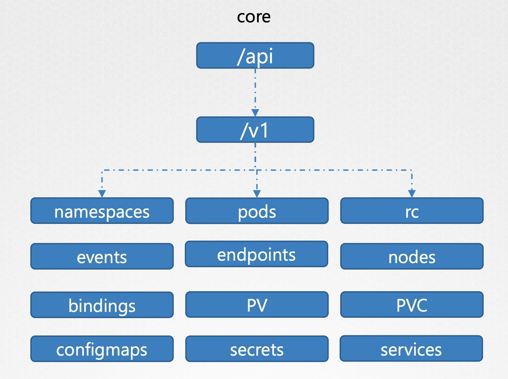
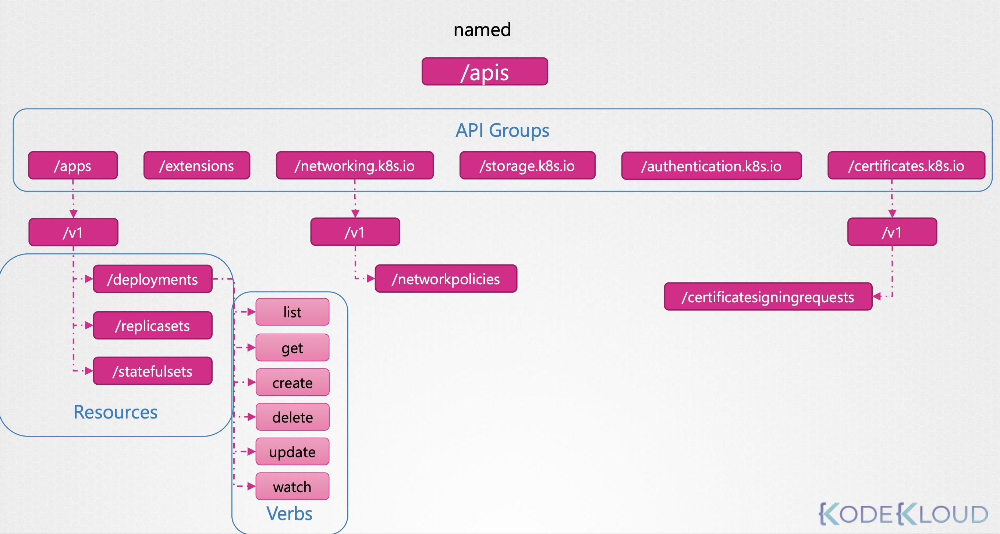

# Kubernetes API Groups 概述
Kubernetes API Server 對外提供的 REST API，會依據不同資源類型，劃分為不同的 API Group。

常見的 API 路徑如下：
| 路徑         | 說明                                |
| ---------- | ------------------------------------ |
| `/version` | 顯示 API Server 的版本資訊             |
| `/healthz` | 健康檢查端點                           |
| `/metrics` | 叢集監控指標，Prometheus 等可存取此路徑   |
| `/api`     | 代表 **Core Group (無名稱)** 的資源     |
| `/apis`    | 代表 **Named Groups**，用於延伸資源     |

# API 分組詳解

## `/api`：Core Group（核心資源）
屬於 Kubernetes 內建的核心資源，API Group 為空（""）。
```
/api/v1/namespaces
/api/v1/pods
/api/v1/services
/api/v1/nodes
/api/v1/configmaps
/api/v1/secrets
/api/v1/persistentvolumes (PV)
/api/v1/persistentvolumeclaims (PVC)
...
```


## `/apis`：Named Groups（命名資源組）
Kubernetes 為了支援 `擴充性與版本管理`，將某些資源拆分為獨立的 Group，例如：
```
/apis/apps/v1/deployments
/apis/batch/v1/jobs
/apis/extensions/v1beta1/ingresses
/apis/rbac.authorization.k8s.io/v1/roles
/apis/networking.k8s.io/v1/networkpolicies
```

你可以透過下列指令列出所有可用的 API Groups：
```bash
curl -s https://kube-master:6443/apis \
  --key admin.key \
  --cert admin.crt \
  --cacert ca.crt | grep "name"
```


---
# API Server 測試範例

## 使用 curl 直接連線 API Server
```bash
curl https://kube-master:6443/version \
  --key admin.key \
  --cert admin.crt \
  --cacert ca.crt

curl https://kube-master:6443/api/v1/pods \
  --key admin.key \
  --cert admin.crt \
  --cacert ca.crt
```

## 通訊路徑整理

### 1. User → Kube API Server（直接）
適合 debug 或憑證驗證測試：
```bash
curl https://localhost:6443 \
  --key admin.key \
  --cert admin.crt \
  --cacert ca.crt
```

### 2. User → `kubectl proxy` → Kube API Server
若不方便操作憑證，可使用 kubectl proxy 轉發連線（本機起 proxy，無需 TLS 驗證）：
```bash
kubectl proxy
# Starting to serve on 127.0.0.1:8001

curl http://localhost:8001/api/v1/pods
```
> `kubectl proxy` 適合開發者快速測試 K8s API，無需手動處理 TLS 憑證，不適合暴露在 production 環境。


**Kube Proxy ≠ Kubectl Proxy**
| 名稱              | 說明                                                      |
| --------------- | ---------------------------------------------------------- |
| `kubectl proxy` | CLI 工具，將本地 8001 port 對應到 K8s API Server，無需 TLS 驗證 |
| `kube-proxy`    | Kubernetes 元件之一，負責轉送 Service 網路流量到後端 Pod         |


## 常用指令
### kubectl explain
查詢資源對應的 API Group（開發與 RBAC 常用）
> 快速查詢某資源對應的 API Group 與版本。
```bash
kubectl explain deployment
# NAME:         deployment.apps
# API Version:  apps/v1
```
```bash
# 查詢子欄位
kubectl explain deployment.spec.template.spec.containers
```

### kubectl api-resources
查看所有可用資源
```bash
# 顯示當前 kube-apiserver 所支援的資源清單及其對應 API Group。
kubectl api-resources
```
### 進階技巧：查詢特定資源的 REST API URL
```bash
kubectl get --raw /apis/apps/v1/deployments
```
或列出所有 core 資源：
```bash
kubectl get --raw /api/v1
```
> 幫助使用者理解 kubectl 背後實際呼叫的 API 是哪一條路徑。

---
# 小結
- Kubernetes API 分為兩大類型：
  - **Core Group**：路徑為 `/api`，如 pods、services、nodes
  - **Named Groups**：路徑為 `/apis`，如 deployments、roles、jobs 等
- API Server 介面可透過 `curl` 進行憑證驗證測試，也可透過 `kubectl proxy` 進行開發端本機 proxy 測試
  - 使用 `curl` + TLS 憑證測試 API Server 安全連線
  - 使用 `kubectl proxy` 在本地啟動 HTTP 代理，可省略 TLS 憑證，適合開發階段
- 開發與權限設定常用工具：
  - `kubectl explain <資源>`：查詢資源所屬的 API Group 與 version
  - `kubectl api-resources`：查看所有可用的資源與所屬 Group
  - `kubectl get --raw`：可查詢原始 API 路徑資料
- 自訂資源（CRD）也會掛載於 `/apis`，屬於 Named Group
- 注意區分 `kubectl proxy` (本地 HTTP proxy) 與 `kube-proxy` (cluster service 網路元件)

📌 下一步建議學習：
RBAC 權限控制中 `apiGroups`, `resources`, `verbs` 如何對應這些 API 分組
