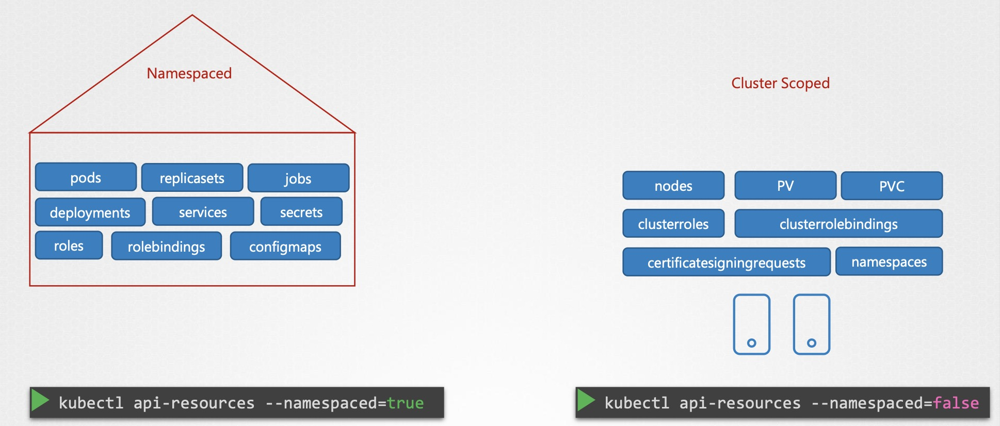

# ClusterRoles
`ClusterRole` 和 `ClusterRoleBinding` 是 **Cluster Scoped 資源**，不屬於任何單一 namespace，可授權跨命名空間或整個叢集的資源，例如：
- `nodes`、`namespaces`、`clusterroles`、`persistentvolumes` 等全域資源
- 可搭配 `RoleBinding` 使用於多個 namespace，達到重複授權

# Namespaced vs Cluster Scoped
在 K8s 中，資源的作用範圍可分為兩大類：**Namespaced（命名空間資源）** 與 **Cluster-scoped（叢集資源）**。這個區分在設定權限（RBAC）、部署應用、管理資源時非常重要。



| 授權類型                        | 資源作用範圍         | 適用情境與實例                         |
|-------------------------------|----------------------|--------------------------------------|
| `Role` / `RoleBinding`         | 單一 namespace       | 一般應用程式權限（如 CRUD Pod）        |
| `ClusterRole` / `RoleBinding`  | 多個 namespace       | ServiceAccount 跨命名空間權限          |
| `ClusterRole` / `ClusterRoleBinding` | 全叢集（含全域資源）   | 管理 cluster-wide 資源，如 `nodes`、CRDs 等 |

> 📌 `ClusterRole` 可以透過 `RoleBinding` 授權給特定 namespace 中的使用者或 ServiceAccount。
> ✅ 這讓你可以重複使用同一個 `ClusterRole`，並以多個 `RoleBinding` 授權給不同命名空間，避免重複定義權限。

## Namespaced 與 Cluster-scoped 資源範例
| 分類                | 說明                                                | 常見資源 |
|---------------------|-----------------------------------------------------|----------|
| **Namespaced**      | 僅存在於某個 namespace，適用於多租戶或資源隔離需求   | `pods`、`services`、`configmaps`、`secrets`、`role`、`rolebinding` |
| **Cluster-scoped**  | 作用於整個叢集，**不屬於任何 namespace**，多用於核心管理資源 | `nodes`、`namespaces`、`persistentvolumes`、`clusterrole`、`clusterrolebinding`、`customresourcedefinition` |

## RBAC 與資源範圍對應

| 權限組合                             | 適用資源類型         | 說明 |
|--------------------------------------|----------------------|------|
| `Role` + `RoleBinding`               | Namespaced 資源      | 精細控制單一 namespace 權限 |
| `ClusterRole` + `RoleBinding`        | Cluster / Namespaced | 跨 namespace 重用 ClusterRole 權限 |
| `ClusterRole` + `ClusterRoleBinding` | Cluster-scoped 資源  | 適用於 cluster-wide 資源授權 |

## 範例比對表
| 資源                         | 作用範圍        | 需使用哪種角色控制                  |
| --------------------------- | -------------- | -------------------------------- |
| `pods`                      | Namespaced     | Role / RoleBinding               |
| `nodes`                     | Cluster-scoped | ClusterRole / ClusterRoleBinding |
| `configmaps`                | Namespaced     | Role                             |
| `namespaces`                | Cluster-scoped | ClusterRole                      |
| `secrets`                   | Namespaced     | Role                             |
| `customresourcedefinitions` | Cluster-scoped | ClusterRole                      |

---
# 建立與操作指令

## 建立 ClusterRole
### cluster-admin-role.yaml
```yaml
apiVersion: rbac.authorization.k8s.io/v1
kind: ClusterRole
metadata:
  name: cluster-administrator
rules:
- apiGroups: [""]
  resources: ["nodes"]
  verbs: ["list", "get", "create", "update", "delete", "watch"]
```
> `watch`：用於監控資源變化，常見於 Controller / Operator

### Kubectl 建立指令
```bash
kubectl create -f cluster-admin-role.yaml
```

## 建立 ClusterRoleBinding
> ⚠️ 使用 `ClusterRoleBinding` 時會影響整個叢集資源，**一旦授權過寬，可能導致重大安全風險**，請務必審慎評估。
> ✅ 可搭配 OPA/Gatekeeper 實施「限制性授權政策」（如禁止 * verbs 或 * resources）。
> 💡 <mark>若只需授權特定 namespace 的權限，請優先使用 `RoleBinding + ClusterRole` 即可。</mark>

### cluster-admin-role.yaml
同上

### cluster-admin-role-binding.yaml
```yaml
apiVersion: rbac.authorization.k8s.io/v1
kind: ClusterRoleBinding
metadata:
  name: cluster-admin-role-binding
subjects:
- kind: User
  name: cluster-admin
  apiGroup: rbac.authorization.k8s.io
roleRef:
  kind: ClusterRole
  name: cluster-administrator
  apiGroup: rbac.authorization.k8s.io
```

### Kubectl 建立指令
```bash
kubectl create -f cluster-admin-role-binding.yaml
```

---
# 補充：ServiceAccount 綁定範例
若你希望某個 Pod 所使用的 ServiceAccount 擁有跨 namespace 的權限，可以這樣建立：
```yaml
# cluster-role-binding-serviceaccount.yaml
apiVersion: rbac.authorization.k8s.io/v1
kind: ClusterRoleBinding
metadata:
  name: backend-access-nodes
subjects:
- kind: ServiceAccount
  name: backend
  namespace: app-ns
roleRef:
  kind: ClusterRole
  name: cluster-administrator
  apiGroup: rbac.authorization.k8s.io
```

---
# 權限驗證與偵錯
## 查詢現有 ClusterRole / ClusterRoleBinding
```bash
kubectl get clusterroles
kubectl get clusterrolebindings
```

## 驗證使用者是否有權限
```bash
kubectl auth can-i [verb] [resource] --as [user] --namespace [ns]

kubectl auth can-i create nodes --as cluster-admin
kubectl auth can-i get    nodes --as system:serviceaccount:app-ns:backend
# 回傳 "yes" 表示有權限，"no" 表示被拒絕
```

## 查詢資源範圍屬性 👍
```bash
kubectl api-resources --namespaced=true   # 顯示所有 namespaced 資源
kubectl api-resources --namespaced=false  # 顯示所有 cluster-scoped 資源
```

---
# 小結
- `ClusterRole` 適用於授權跨 namespace 或 cluster-wide 資源存取。
- `ClusterRoleBinding` 是全叢集生效，需謹慎授權。
- 若使用者只需在 namespace 操作，建議使用 `RoleBinding + ClusterRole`。
- 若有跨 namespace 需求：
  - `ClusterRole + RoleBinding`：適用於 `跨 namespace` 重複授權相同權限
  - `ClusterRole + ClusterRoleBinding`（統一授權全域資源）：適用於需要 `全叢集資源控制的管理者`
- 常搭配 `kubectl auth can-i` 指令驗證權限，避免授權錯誤。
