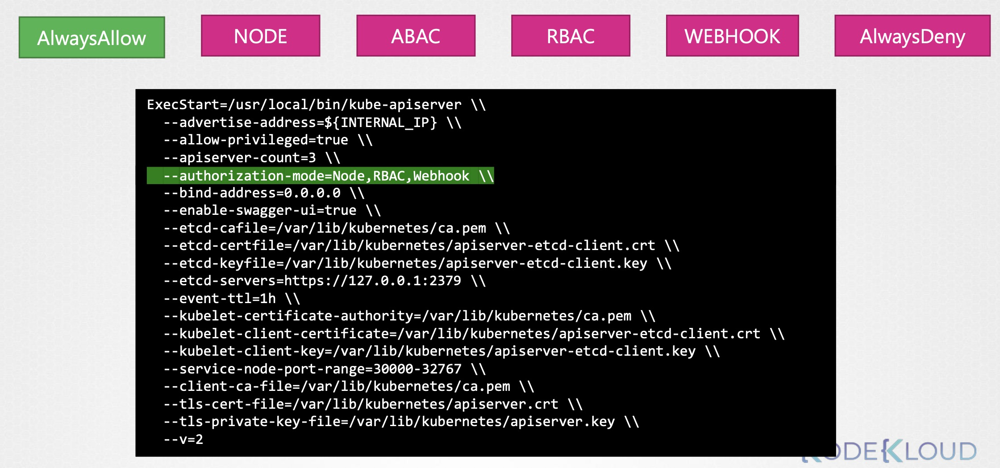
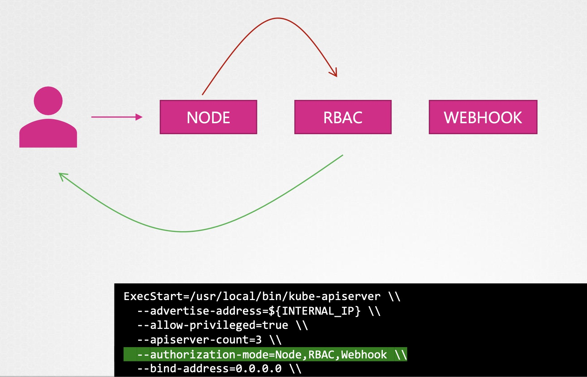
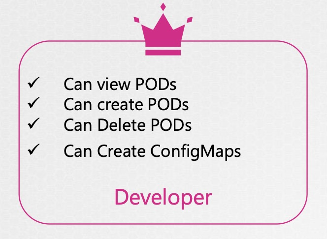
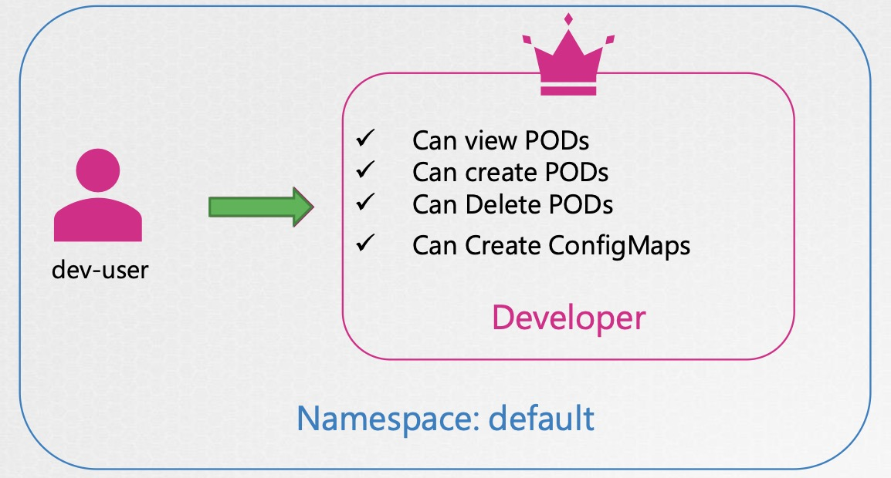

# Why Authorization?
在 K8s 中，不同類型的實體（例如 Admins、Developers、Bots）執行的操作權限應有所區隔，以維護叢集的安全性與資源隔離。因此，我們需要使用 `授權機制（Authorization Mechanisms）` 來精細控管誰可以做什麼。

## Authorization Mechanisms

### Node Authorizer
Node Authorizer 是一種專門授權給 Kubernetes **kubelet（節點代理程式）** 的機制，允許它只能存取與其自身相關的資源。
> 這是一種特殊的授權方式，僅適用於節點自身，與一般使用者授權不同。

📌 補充：kubelet 還能讀取其所在節點的 ConfigMap 和 Secrets（如果 pod 有 mount）。

- 認證方式：
  - `Kube API Server` 通過 **user identity** 與 **TLS certificate** 判斷請求來源是否為節點。
- 適用對象：
  - `kubelet`（節點）
- 節點允許操作的資源範圍如下：
  - Read: Services、Endpoints、Nodes（僅限自身資訊）、Pods（僅限指派給該 Node 的 Pods）
  - Write: Node status、Pod status、events

### ABAC
ABAC 是早期 Kubernetes 所支援的授權機制之一，透過靜態 JSON policy 檔案控制每個使用者對資源的操作權限。

- 缺點：
  - 無法細緻管理
  - 權限定義採靜態設定，不易維護
  - 無法動態調整：無法根據動態條件做出授權決策
  - 無法做到角色抽象（Role-based grouping）
  - 設定變更需重新啟動 API Server
- 實務現況：
  - <mark>已被 RBAC 取代，Kubernetes 1.8+ 預設啟用 RBAC。</mark>

#### ABAC 實例說明
| 使用者 / 群組     | 權限內容               |
| ------------ | ------------------ |
| `dev-user`   | 可檢視、建立、刪除 Pods     |
| `dev-user-2` | 可檢視、建立、刪除 Pods     |
| `dev-users`  | （群組）可檢視、建立、刪除 Pods |
| `security-1` | 可檢視與核准 CSR（憑證簽署請求） |

完整 ABAC Policy（單一使用者範例）(e.g. dev-user)
```json
{
  "apiVersion": "abac.authorization.kubernetes.io/v1beta1",
  "kind": "Policy",
  "spec": {
    "user": "dev-user",
    "namespace": "*",
    "resource": "pods",
    "apiGroup": "*",
    "verb": "*"
  }
}
```

多筆簡化 ABAC Policy（陣列格式）
```json
[
  {"kind": "Policy", "spec": { "user": "dev-user", "namespace": "*", "resource": "pods", "apiGroup": "*" }},
  {"kind": "Policy", "spec": { "user": "dev-user-2", "namespace": "*", "resource": "pods", "apiGroup": "*" }},
  {"kind": "Policy", "spec": { "group": "dev-users", "namespace": "*", "resource": "pods", "apiGroup": "*" }},
  {"kind": "Policy", "spec": { "user": "security-1", "namespace": "*", "resource": "csr", "apiGroup": "*" }}
]
```

### RBAC（Role-Based Access Control）
RBAC 是目前 Kubernetes 預設且推薦使用的授權機制，透過角色與綁定來控制使用者與資源間的權限關係。
- 設計理念
  - Role/ClusterRole：定義一組權限（verbs + resources）
  - RoleBinding/ClusterRoleBinding：將角色賦予給特定的使用者、群組或 ServiceAccount

#### 權限範例角色設計
- Developer 角色
  - ✓ Can view PODs
  - ✓ Can create PODs
  - ✓ Can Delete PODs
  - ✓ Can Create ConfigMaps
  - 對應使用者／群組：dev-user, dev-user-2, dev-users
- Security 角色
  - ✓ Can view CSR（CertificateSigningRequest, 憑證簽署流程資源）
  - ✓ Can approve CSR
  - 對應使用者： security-1

### Webhook (OPA)
Webhook 模式允許 K8s 把授權判斷交由外部系統決策，最常見的實作是 [OPA - Open Policy Agent](https://www.openpolicyagent.org/)。
> `Gatekeeper` 是實作 OPA 的常用工具。

#### 授權流程
1. 使用者（例如 `dev-user`）發送操作請求，例如建立 Pod。
2. API Server 傳送請求至 OPA webhook：API Server 根據 --authorization-mode=Webhook 設定，呼叫外部 Webhook 伺服器。
3. Webhook（如 OPA）根據 Rego Policy 檢查是否允許（allow）該操作。
4. Webhook 回傳 JSON 結果：
    - HTTP 200 OK
    - `allowed: true`（或 false）
    ```json
    {
      "apiVersion": "authorization.k8s.io/v1",
      "kind": "SubjectAccessReview",
      "status": {
        "allowed": true
      }
    }
    ```

## Authorization Mode（授權模式）
Kubernetes 支援多種授權模式，可同時啟用、並依照順序判斷：
| 模式類型          | 說明                                |
| ------------- | ------------------------------------- |
| `Node`        | 僅授權 kubelet 對自己相關資源進行操作      |
| `ABAC`        | 靜態 JSON-based 授權（已不建議）         |
| `RBAC`        | 推薦使用的角色型授權，支援群組、角色綁定等   |
| `Webhook`     | 呼叫外部系統（如 OPA）進行決策            |
| `AlwaysAllow` | 所有請求都允許（不安全，僅用於測試）        |
| `AlwaysDeny`  | 所有請求都拒絕（不實用）                  |



### API Server 啟動參數範例
```bash
ExecStart=/usr/local/bin/kube-apiserver \
  --advertise-address=${INTERNAL_IP} \
  --allow-privileged=true \
  --apiserver-count=3 \
  --authorization-mode=Node,RBAC,Webhook \
  # 其他參數略 ...
```
> 可同時啟用多種授權機制，**系統會依序進行授權檢查**。




`--authorization-mode=Node,RBAC,Webhook` 的授權順序如下：
`**Node → RBAC → Webhook**`
一旦任一授權模式允許該請求，API Server 即允許此操作。

⚠ ABAC 與 RBAC 無法同時混用，需在啟動參數中選擇要用哪一個，且 ABAC 修改 policy 後需重啟 API Server。


---
# RBAC

## API Group 與 RBAC 對應關係
| 資源         | API Group                  | RBAC 設定                                    |
| ----------- | --------------------------- | ------------------------------------------ |
| pods        | `""` (core group)           | `apiGroups: [""]`                          |
| deployments | `apps` (apps group)         | `apiGroups: ["apps"]`                      |
| RBAC 相關資源（roles, rolebindings）| `rbac.authorization.k8s.io` | `apiGroups: ["rbac.authorization.k8s.io"]` |

## Role 定義範例
- Role 是 namespace 級別的權限設定。
- developer role 允許對 pods 做常用操作，並可建立 configmaps。
- 可限制特定資源名稱（resourceNames）來細化權限。

## RoleBinding 綁定使用者
- RoleBinding 將 Role 角色授權給特定 user 或 group。
- 可綁定 User、Group 兩種 kind，方便配合 AD/LDAP 使用。


**補充：Role/RoleBinding vs ClusterRole/ClusterRoleBinding**
| 角色類型                          | 使用範圍              | 適用場景                          |
| -------------------------------- | ----------------------- | ------------------------------- |
| Role/RoleBinding               | 單一 namespace           | 需限制在某 namespace             |
| ClusterRole/ClusterRoleBinding | 全 cluster 或跨 namespace | 跨 namespace 或需存取 cluster-wide 資源如 nodes、secrets |

⚠ 補充：「若你需讓一個 ServiceAccount 存取不同 namespace 的資源，應使用 `ClusterRole` + `RoleBinding` 在各命名空間分別綁定」。

<br>

**補充：ClusterRoleBinding**
- 將 ClusterRole 授權給特定使用者，作用範圍為整個 cluster 或跨 namespace。

<br>

**實務場景應用建議**
| 用途                | 建議方式                                  |
| ----------------- | ----------------------------------------- |
| 單 Namespace 權限控制  | 使用 `Role + RoleBinding`               |
| 跨 Namespace 或叢集資源 | 使用 `ClusterRole + ClusterRoleBinding` |
| 外部政策控制            | 整合 OPA + Gatekeeper                   |
| 動態用戶群管理           | 搭配 AD/LDAP group                      |


## 指令操作

### Create Role


#### developer-role.yaml
```yaml
apiVersion: rbac.authorization.k8s.io/v1
kind: Role
metadata:
  name: developer
rules:
- apiGroups: [""]
  resources: ["pods"]
  verbs: ["list", "get", "create", "update", "delete"]
- apiGroups: [""]
  resources: ["configmaps"]
  verbs: ["create"]
```


限制只能使用哪些 resourceNames ("blue", "orange")
```yaml
# developer-role.yaml
apiVersion: rbac.authorization.k8s.io/v1
kind: Role
metadata:
  name: developer
rules:
- apiGroups: [""]
  resources: ["pods"]
  verbs: ["get", "create", "update"]
  resourceNames: ["blue", "orange"]
```


#### Kubectl Command
```bash
kubectl create -f developer-role.yaml
```

### Binding role and users


#### developer-role.yaml
同上

#### devuser-developer-binding.yaml
```yaml
apiVersion: rbac.authorization.k8s.io/v1
kind: RoleBinding
metadata:
  name: devuser-developer-binding
  namespace: dev-ns
subjects:
- kind: User
  name: dev-user
  apiGroup: rbac.authorization.k8s.io
roleRef:
  kind: Role
  name: developer
  apiGroup: rbac.authorization.k8s.io
```


RBAC 的 subjects 支援 3 種 kind：
```yaml
subjects:
- kind: User
  name: dev-user
  apiGroup: rbac.authorization.k8s.io
- kind: Group
  name: dev-team
  apiGroup: rbac.authorization.k8s.io
- kind: ServiceAccount
  name: backend
  namespace: app-ns
```
> 📌 當你的 cluster 使用 AD/LDAP 整合，group 綁定會非常常見。


#### Kubectl Command
```bash
kubectl create -f devuser-developer-binding.yaml
```

---
# 常用指令

## View RBAC
查看角色與綁定
```bash
kubectl get roles

kubectl get rolebindings
```

針對角色詳細資訊
```bash
kubectl describe role [role_name]
kubectl describe role developer

kubectl describe rolebinding [rolebinding_name]
kubectl describe rolebinding devuser-developer-binding
```

## Check Access
權限檢查
```bash
kubectl auth can-i [verb] [resource] --as [user] --namespace [ns]

kubectl auth can-i create deployments
kubectl auth can-i create deployments --as dev-user
kubectl auth can-i create pods        --as dev-user
kubectl auth can-i create pods        --as dev-user --namespace test
kubectl auth can-i create pods        --as system:serviceaccount:app-ns:backend

kubectl auth can-i delete nodes

kubectl auth can-i get secrets --as dev-user
# → no
```

若是 ClusterRole，記得補上 `--all-namespaces` 或 `--namespace` 以驗證生效範圍。
```bash
kubectl auth can-i get pods --as dev-user --namespace default
```

---
# 小結
- Kubernetes 提供多種授權模式：
  - **Node Authorizer**：授權 kubelet 等 node 元件存取必要資源
  - **ABAC**：透過靜態 JSON Policy 授權（已較少使用）
  - **RBAC**：最常見，透過 Role/ClusterRole 與 RoleBinding 控管權限
  - **Webhook**：交由外部系統如 OPA 決策授權
- `--authorization-mode` 可同時啟用多種授權機制（Node, RBAC, Webhook）
- RBAC 基本結構：
  - `Role/ClusterRole` 定義權限
  - `RoleBinding/ClusterRoleBinding` 指派權限給 User/Group/ServiceAccount
- 開發常用工具：
  - `kubectl auth can-i`
  - `kubectl get roles`、`rolebindings`
  - `kubectl describe role` 快速 debug 權限

📌 下一步建議：
了解 **ServiceAccount 與 RoleBinding 搭配 Pod 運行身份**，進入實務應用場景。
