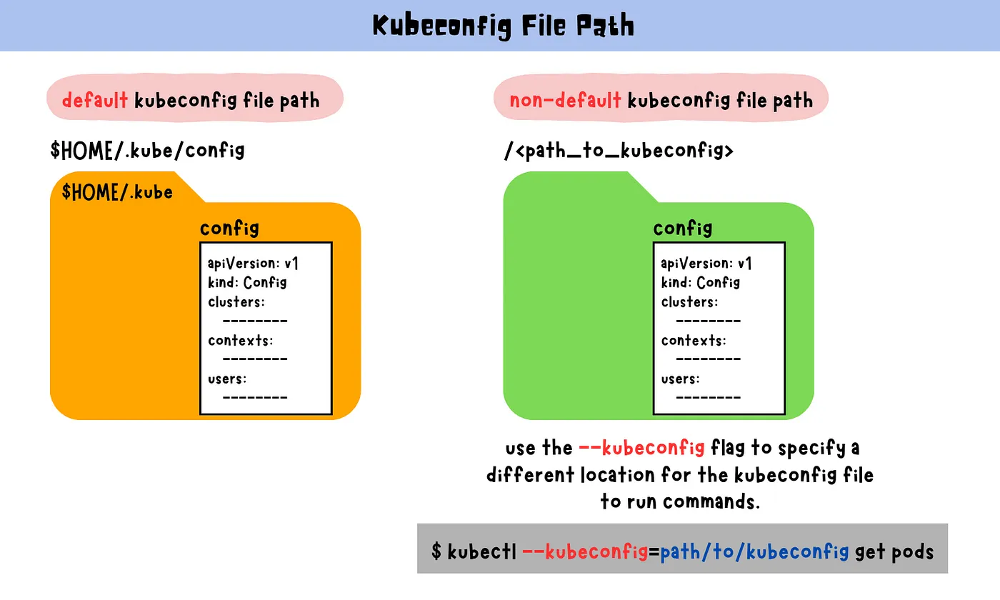
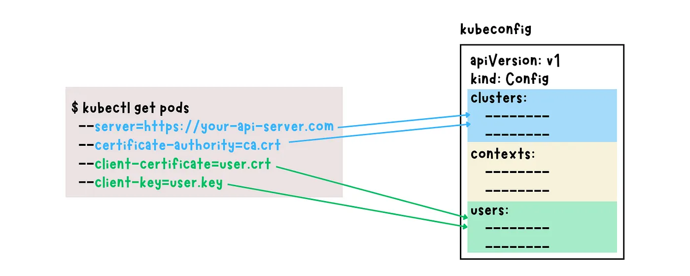
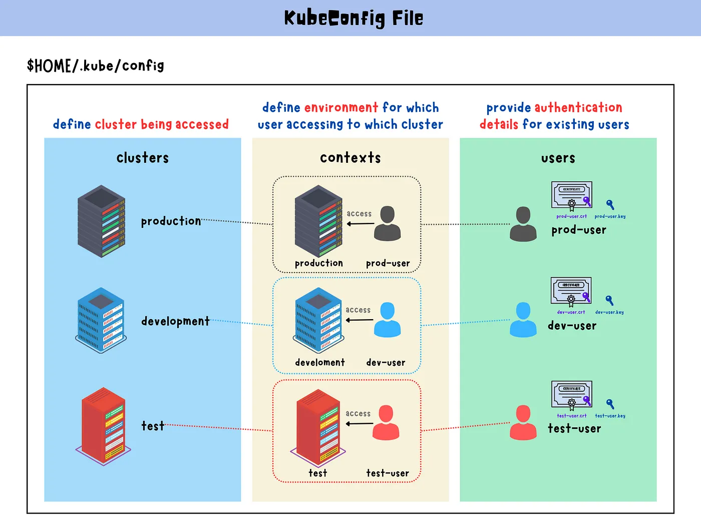
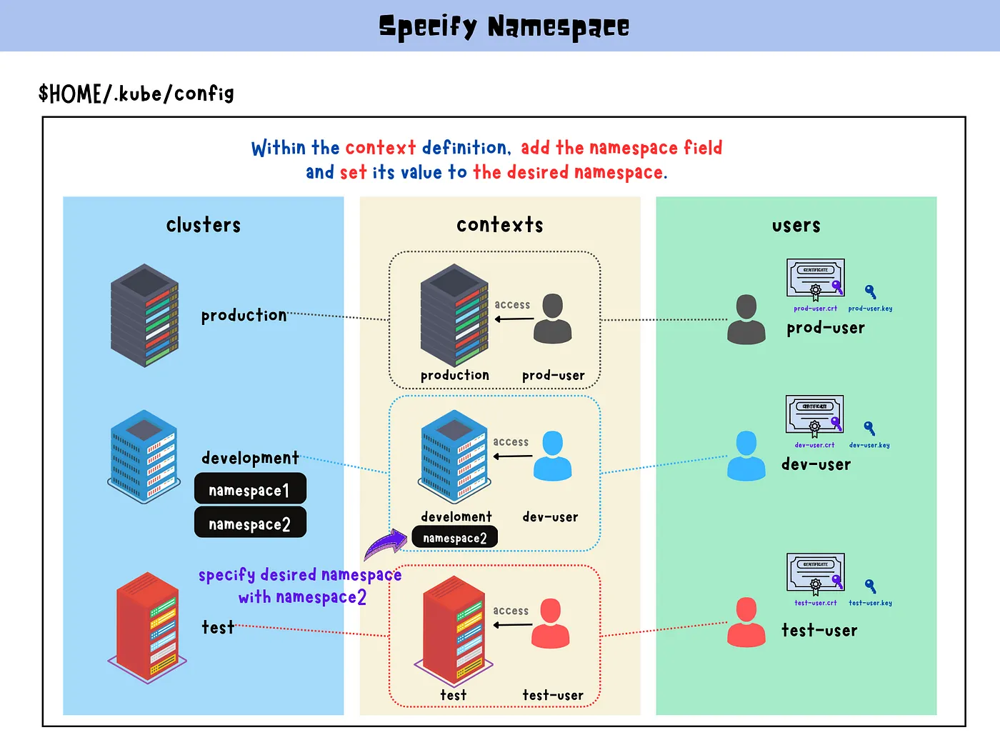

# KubeConfig 概述

KubeConfig 是 K8s 客戶端（kubectl）與 API Server 通訊所依賴的設定檔。它包含：
- 使用者身份驗證資訊（client certificate / token）
- API Server 的連線位置與憑證
- 多環境 context 的定義與切換

## 使用憑證直接存取 API Server

不透過 kubeconfig，可使用 `curl` 或 `kubectl` 明確指定憑證：
```bash
curl https://my-kube-playground:6443/api/v1/pods \
  --key admin.key \
  --cert admin.crt \
  --cacert ca.crt
```

```bash
kubectl get pods \
  --server my-kube-playground:6443 \
  --client-key admin.key \
  --client-certificate admin.crt \
  --certificate-authority ca.crt
```

## 使用 kubeconfig 存取集群
預設情況下，kubectl 會從以下路徑載入設定：
```
$HOME/.kube/config
```

你也可以使用 --kubeconfig 指定其他配置檔：
```bash
kubectl get pods --kubeconfig=my-cluster-config.yaml
kubectl get pods   # 預設使用 $HOME/.kube/config
```



---
# KubeConfig 結構說明



```yaml
apiVersion: v1
kind: Config

current-context: dev-user@google

clusters:
- name: my-kube-playground
  cluster:
    certificate-authority: /etc/kubernetes/pki/ca.crt
    server: https://my-kube-playground:6443
- name: [another-cluster]

contexts:
- name: my-kube-admin@my-kube-playground
  context:
    cluster: my-kube-playground
    user: my-kube-admin
- name: [another-context]

users:
- name: my-kube-admin
  user:
    client-certificate: /etc/kubernetes/pki/users/admin.crt
    client-key: /etc/kubernetes/pki/users/admin.key
- name: [another-user]
```

## YAML 中的 current-context
| 問題 | 解答 |
|------|------|
| `current-context`<br>可以放多個嗎？ | ❌ 不行，current-context 只能有一個。代表當前預設使用的 context。 |
| `current-context`<br>不放會怎樣？ | 預設情況下 `kubectl` 會無法知道要使用哪一個 context，執行會出錯或需手動指定 `--context`。 |

若要切換 `current-context`，請使用以下指令：
```bash
kubectl config use-context prod-user@production

kubectl config -h
```

## Context 與 Namespace 綁定


每個 context 可以綁定不同的命名空間，達到同一個 cluster 上的多租戶管理：

```yaml
# ...

contexts:
- name: my-kube-admin@my-kube-playground
  context:
    cluster: my-kube-playground
    user: my-kube-admin
    namespace: finance  # 預設 namespace

# ...
```
> 若 context 中未設定 namespace，則預設為 default。
> 在 kubeconfig YAML 結構中，<mark>namespace 只能出現在 contexts: 裡的 context 子欄位中</mark>。


**Namespace 優先權說明**：  
若同時在 `context` 設定與 CLI 中指定 namespace，kubectl 會**優先採用 CLI 的 `--namespace`** 參數。

```bash
kubectl get pods --namespace=dev
# 覆蓋 kubeconfig 裡 context 的 namespace 設定
```


## 支援 base64 編碼憑證與憑證內嵌
你可以使用 certificate-authority-data 或 client-certificate-data 直接嵌入 base64 編碼的內容：

```yaml
# ...

clusters:
- name: production
  cluster:
    certificate-authority-data: [base64 編碼的 ca.crt]
    server: https://my-kube-playground:6443

users:
- name: my-kube-admin
  user:
    client-certificate-data: [base64 編碼的 admin.crt]
    client-key-data: [base64 編碼的 admin.key]
```

產出 base64 編碼方式：
```bash
base64 -w 0 ca.crt       # -w 0 表示不換行
base64 -w 0 admin.crt
base64 -w 0 admin.key
# or
base64 ca.crt | tr -d '\n'
base64 admin.crt | tr -d '\n'
base64 admin.key | tr -d '\n'
```


# 常用指令彙總
```bash
# 查看目前的 KubeConfig 的設定內容
kubectl config view
kubectl config view --kubeconfig=my-cluster-config.yaml

# 使用不同的 config 檔
kubectl --kubeconfig=/path/to/my-cluster-config.yaml get pods

# 切換 context
kubectl config use-context dev-user@google

# 列出所有 context
kubectl config get-contexts

# 抓 context 名稱
kubectl config get-contexts -o name

# 設定預設 namespace
kubectl config set-context my-context --namespace=finance
```

```bash
# 建立新的 context
kubectl config set-context dev@dev-cluster \
  --cluster=dev-cluster \
  --user=dev-user \
  --namespace=dev-namespace

# 建立新的使用者（搭配 token 或 cert）
kubectl config set-credentials dev-user \
  --client-certificate=./dev-user.crt \
  --client-key=./dev-user.key

# 建立新的 cluster 設定
kubectl config set-cluster dev-cluster \
  --server=https://dev.example.com:6443 \
  --certificate-authority=./ca.crt
```

# 小結
- kubeconfig 支援多個使用者、多個叢集、多組 context
- current-context 只能存在一個，是預設操作對象
- context 可綁定 cluster、user、namespace
- 憑證可以使用路徑或 base64 方式設定
- 使用 kubectl config 管理多環境操作非常方便
- context 可指定預設 namespace，亦可在 CLI 使用 `--namespace` 臨時覆蓋。

---
# Reference
1. [Kubernetes: Kubeconfig File](https://yuminlee2.medium.com/kubernetes-kubeconfig-file-4aabe3b04ade)