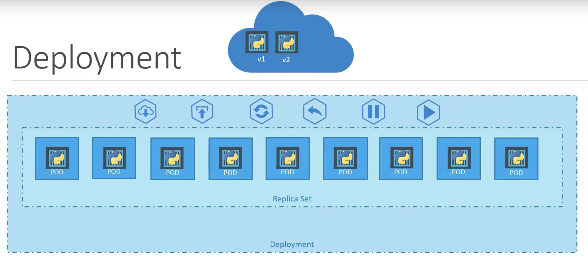
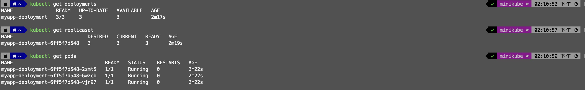
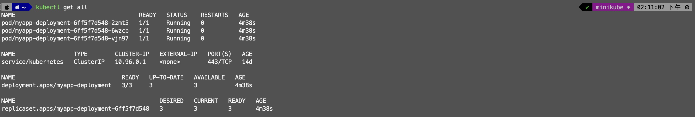

# Deployment
An API object that manages a replicated application, typically by running Pods with no local state.

📌 A Kubernetes Deployment is a higher-level object that provides capabilities such as `seamless rolling updates to underlying instances`, `the ability to undo changes`, and the option to `pause and resume changes as required`.
📌 Kubernetes Deployments are commonly used to deploy and manage multiple instances of applications in a `production environment`.



# Key Reasons for Using a Deployment
1. `Rolling Updates`: 
    - This allows for seamless updates to the underlying instances (pods) without downtime by gradually replacing the old versions of pods with new ones.
    - `Don't upgrade all at once`, as it may impact users accessing your applications. Instead, upgrade one after the other, using a process called rolling updates.
2. `Rollback`:
    - If something goes wrong during an update, a Deployment can undo changes and revert to a previous stable state.
    - Undo the recent change. Roll back the changes that were recently carried out.
3. `Pause and Resume`: 
    - Updates can be paused and resumed, which is useful for controlling the deployment process and debugging issues.
    - You don't want to apply each change immediately after the command is run. Instead, you would like to apply a pause to your environment, make the changes, and then resume so that all the changes are rolled out together.

---
# Deployment with YAML
Template:
```yaml
apiVersion: apps/v1
kind: Deployment
metadata:
  name: [custom_name]
  labels:
    [custom_key]: [custom_value]
    ...
spec:
  template:
    [[ POD ]]
  replicas: [number]
  selector:
    matchLabels:
      [pod_labels_key]: [pod_labels_value]
```

deployment-definition.yml
```yaml
apiVersion: apps/v1
kind: Deployment
metadata:
  name: myapp-deployment
  labels:
    app: myapp
    type: front-end
spec:
  template:
    metadata:
      name: myapp-pod
      labels:
        app: myapp
        type: front-end
    spec:
      containers:
        - name: nginx-container
          image: nginx
  replicas: 3
  selector:
    matchLabels:
      type: front-end
```

RUN commands
```shell
$ kubectl create -f deployment-definition.yml
$ kubectl get deployments
$ kubectl get replicaset
$ kubectl get pods
```


```shell
$ kubectl get all
```



👍 Quickly create Kubernetes YAML Templates
In k8s version 1.19+, we can specify the --replicas option to create a deployment with 3 replicas.
```shell
$ kubectl create deployment --image=httpd:2.4-alpine httpd-frontend --replicas=3
```

## kubectl create vs. kubectl run

### 📝 kubectl create
> Create a resource from a file or from stdin. 
> JSON and YAML formats are accepted.

Create a deployment
```shell
$ kubectl create deployment --image=nginx nginx
```

Generate Deployment YAML file (-o yaml). Don't create it(--dry-run) and save it to a file.
```shell
$ kubectl create deployment --image=nginx nginx --dry-run=client -o yaml > nginx-deployment.yaml
```

Make necessary changes to the file (for example, adding more replicas) and then create the deployment.
```shell
$ kubectl create -f nginx-deployment.yaml
```


### 📝 kubectl run
> Create and run a particular image in a `pod`.

Create an NGINX Pod
```shell
$ kubectl run nginx --image=nginx
```

Generate POD Manifest YAML file (-o yaml). Don't create it (--dry-run) and save it to a file.
```shell
$ kubectl run redis --image=redis --dry-run=client -o yaml > redis_template.yaml
$ kubectl create -f redis_template.yaml
```


---
# References
- [Deployment](https://kubernetes.io/docs/concepts/workloads/controllers/deployment/)
- [kubectl create](https://kubernetes.io/docs/reference/kubectl/generated/kubectl_create/)
- [kubectl run](https://kubernetes.io/docs/reference/kubectl/generated/kubectl_run/)
- [kubectl Usage Conventions](https://kubernetes.io/docs/reference/kubectl/conventions/) 👍
