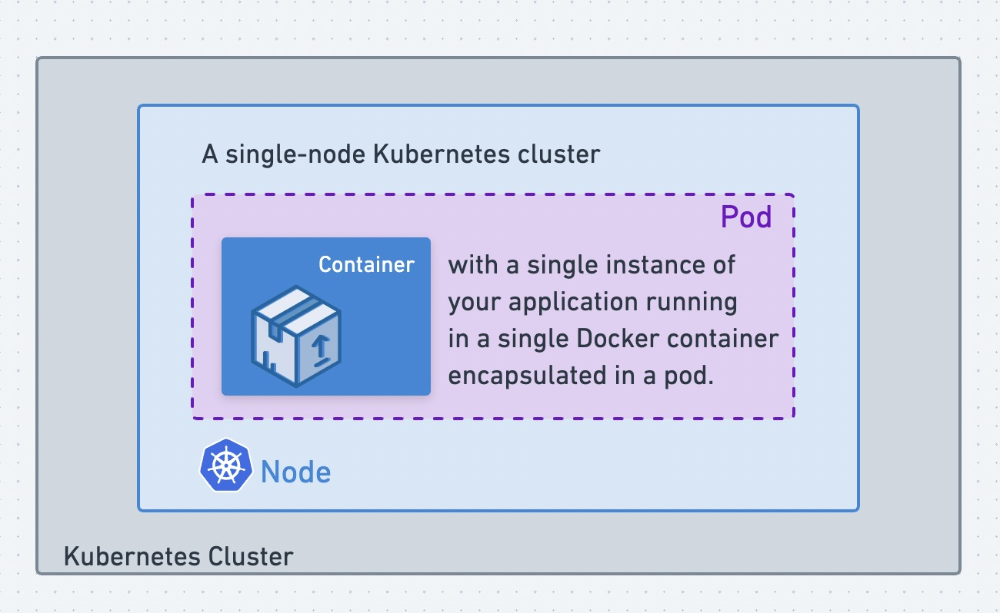
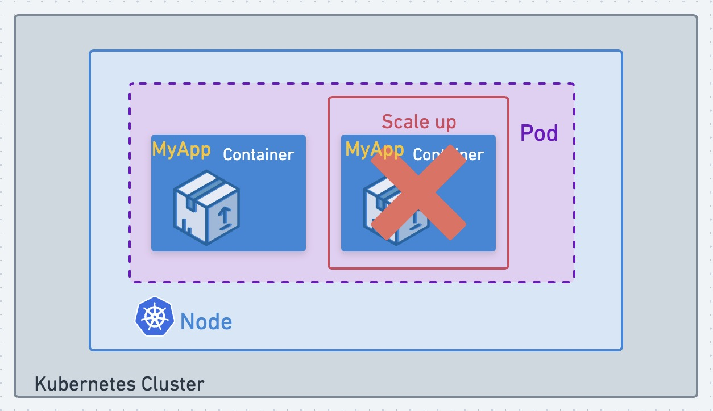
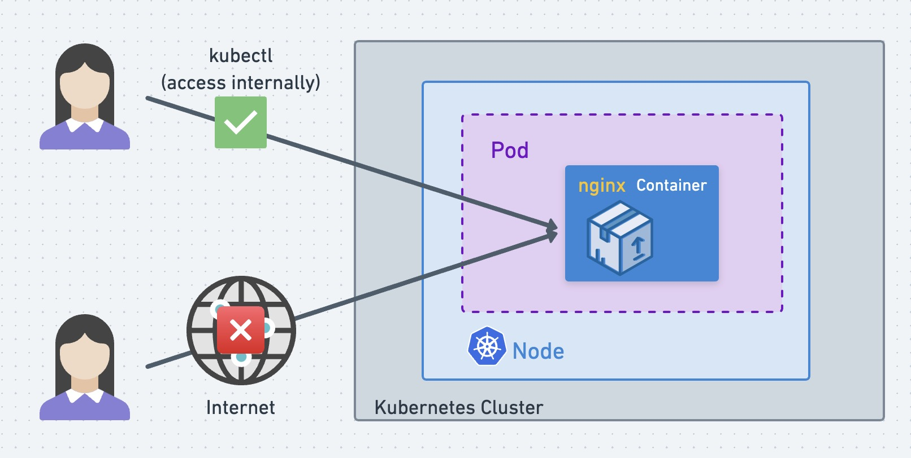
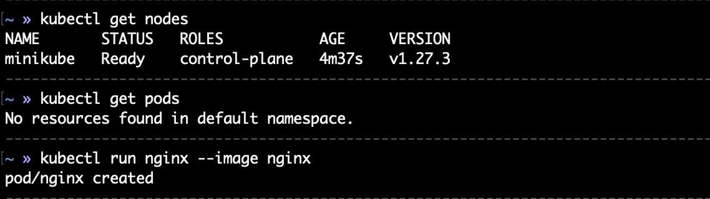
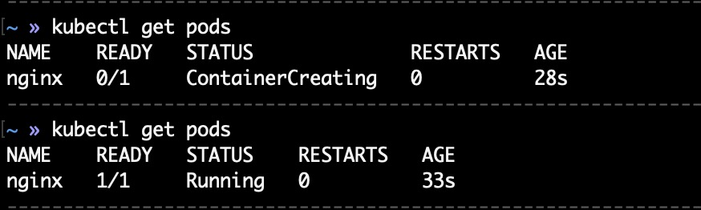
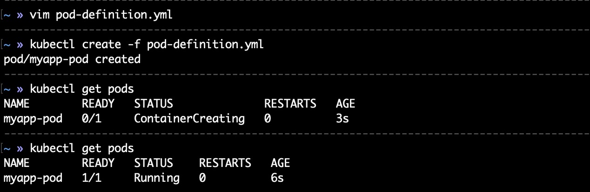
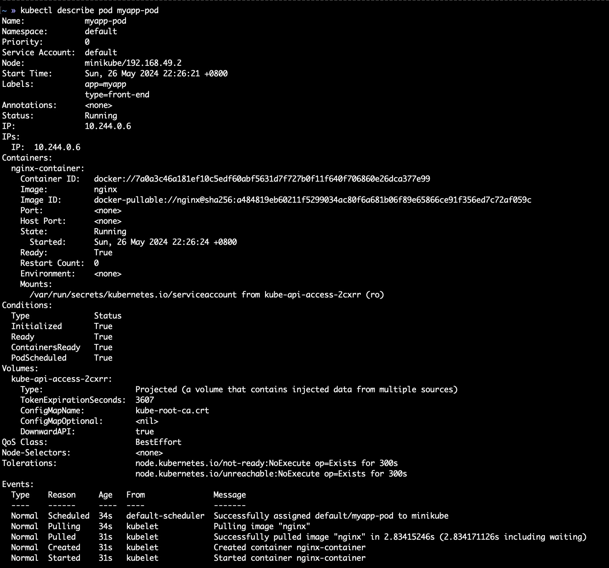

# Pods

📌 Kubernetes doesn't deploy containers directly on the worker node. The containers are encapsulated into "pods".
📌 A pod is a single instance of an application. A pod is the smallest object that you can create in Kubernetes.


## [Why does Kubernetes use pods?](https://www.redhat.com/en/topics/containers/what-is-kubernetes-pod) 🤔
Pods are designed to have one (common use case) or more (advanced use cases) containers.

Grouping containers in this way allows them to communicate with each other, while still remaining isolated to some degree. Containers in a single pod are designed to share common compute resources, such as same storage, same network, same namespace, and be created together and destroyed together. 

This is a good thing in the long run because your application is now ready to handle future architectural changes and scale. Organizing containers into pods allows horizontal scalability of applications. Pods can be replicated across different nodes, enabling resistance to failure. 


## The simplest case

```
        Big        > ----------- > --- > --------- >    Small
Kubernetes Cluster > Worker Node > Pod > Container > Application
```

The image below contains the following components:
- A Kubernetes cluster
- A single worker node
- A single pod
- A single container
- A single application

Explanation:
`A single-node Kubernetes cluster` with `a single instance of your application` running in `a single Docker container` encapsulated in `a single pod`.



## Best Practice

📌 Pods usually have a one-to-one relationship with containers running your application. Multiple containers running in a Pod is a rare use case.

📌 Don't add additional (same kind) containers to an existing pod to scale your application!

> A Pod contains at most one container of the same type.
> 

📌 當連線到應用程式的使用者增加時，該如何擴展你的應用程式來分攤負載（share the load）？

> `[ X ]` 在同一個 Pod 中，啟動新的 Container。
> (A cluster, a worker node, two containers in a pod)

> `[ O ]` 新增一個 Pod ，並在其中啟動新的 Container。
> (A cluster, a worker node, two pods, a container in a pod)

> `[ O ]` 若當前 worker node 沒有足夠容量時，新增一個 worker node，並在該 worker node 上新增一個 Pod，接著在 Pod 上啟動新的 container。
> (A cluster, two worker nodes, a worker node can have multiple pods, a container in a pod)


---
# 圖解 Kubectl Command

📌 Kubectl Command 會自動創建一個 Pod，並在其內部署一個 Container。

```shell
$ kubectl run nginx --image nginx
```



```shell
$ kubectl get pods
```



# YAML in Kubernetes
- Note: 
  - apiVersion: string
  - kind: string
  - metadata: dictionary
  - containers: list/array
- Check "kind" for pod/replicationcontroller/replicaset/deployment/service
  ```shell
  $ kubectl explain [pod | replicationcontroller | replicaset | deployment | service]
  ```

definition.yml
```yaml
apiVersion: [v1 | apps/v1]
kind: [Pod | Service | ReplicaSet | Deployment]
metadata:
  name: [custom_name]
  labels:
    [custom_key_1]: [custom_value_1]
    [custom_key_2]: [custom_value_2]
    ...
spec:
  containers:
    - name: [container1_name]
      image: [image1_name]
    - name: [container2_name]
      image: [image2_name]
    ...
```

👍 Quickly create Kubernetes YAML Templates
```shell
$ kubectl run redis --image=redis --dry-run=client -o yaml > redis_template.yaml
$ kubectl create -f redis_template.yaml
```


## Pods with YAML
pod-definition.yml
```yaml
apiVersion: v1
kind: Pod
metadata:
  name: myapp-pod
  labels:
    app: myapp
    type: front-end
spec:
  containers:
    - name: nginx-container
      image: nginx
```

Run pod-definition.yml
```shell
$ kubectl create -f pod-definition.yml
or
$ kubectl apply -f pod-definition.yml

$ kubectl get pods
$ kubectl get pods -o wide
```


View Pod details
```shell
$ kubectl describe pod [myapp-pod]
```


Delete Pod
```shell
$ kubectl delete pod [myapp-pod]
```


## Service with YAML
service-definition.yml
```yaml
apiVersion: v1
kind: Service
metadata:

spec:

```


## ReplicaSet with YAML
replicaset-definition.yml
```yaml
apiVersion: apps/v1
kind: ReplicaSet
metadata:
  name: myapp-replicaset
  labels:
    app: myapp
    type: front-end
spec:
  template:
    metadata:
      name: myapp-pod
      labels:
        app: myapp
        type: front-end
    spec:
      containers:
        - name: nginx-container
          image: nginx
  replicas: 3
  selector:
    matchLabels:
      type: front-end
```


## Deployment with YAML
deployment-definition.yml
```yaml
apiVersion: apps/v1
kind: Deployment
metadata:

spec:

```


# References
- [What is a Kubernetes pod?](https://www.redhat.com/en/topics/containers/what-is-kubernetes-pod)
- [Newbie: Why are pods needed?](https://www.reddit.com/r/kubernetes/comments/u1xva3/newbie_why_are_pods_needed/)
