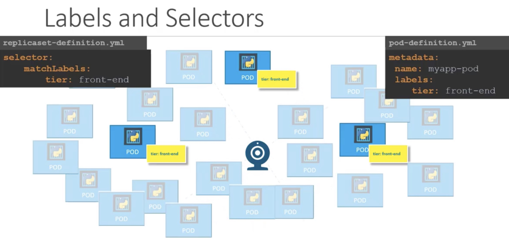
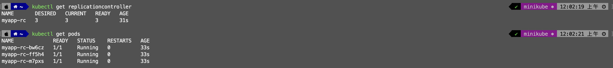
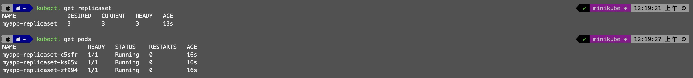

# Q&A

## What are Kubernetes Controllers?
- Brain of Kubernetes: 
  - Controllers are essentially the decision-makers within the Kubernetes. 
  - They are responsible for observing the state of the cluster and taking actions to ensure the desired state is achieved and maintained.


## Key Reasons for Using a RC
Note: Replication Controller (RC)

### Ensuring High Availability
> 場景一：為了避免只有一個 Pod 且又恰巧崩潰而導致使用者無法使用該應用程式，因此會建議同時運行「多個應用程式副本」，並且一個應用程式只會運行於一個 Pod 內。這新生成的 Pod 會依照 Node 資源使用狀況，被分配到原 Node 或新的 Node 上。
- By maintaining multiple replicas of a pod, an RC ensures that your application remains available even if individual pods fail or are terminated. This redundancy is crucial for high availability and fault tolerance.
- `Does that mean you can't use a Replication Controller if you plan to have a single Pod?` 🤔
  - `No.` Even if you have a single pod, the Replication Controller can help by automatically bringing up a new pod when the existing one fails.
  - Thus, the Replication Controller ensures that a specified number of pods are running at all times, even if it's just 1 or 100.

### Load Balancing & Scaling
> 場景二：為了建立多個 Pod 來共享它們之間的負載。
> 
- It helps us to share/balance the load across multiple pods on different nodes as well as scale our application when the demand increases.


## ReplicationController vs. ReplicaSet
1. Both have the same purpose, but they are not the same.
    - ReplicaSet is the next-generation ReplicationController that supports the new set-based label selector.
    - The two behave similarly, except that a ReplicationController does not support set-based selector requirements as described in the labels user guide. 
2. `ReplicaSet` is preferred over ReplicationController.

```
📌 The selector is one of the major differences between Replication Controller and ReplicaSet.
  - The selector helps the ReplicaSet identify what pods fall under it. ReplicaSet can also manage pods that were not created as part of the ReplicaSet creation.
  - ReplicaSet maintains the desired number of replicas across all pods that fit its criteria (match labels specified in the selector), regardless of whether they were created before (existing pods) or after the ReplicaSet itself.
```



### ReplicationController
A ReplicationController ensures that a specified number of pod replicas are running at any one time. In other words, a ReplicationController makes sure that a pod or a homogeneous set of pods is always up and available.

#### ReplicationController with YAML
Template:
```yaml
apiVersion: v1
kind: ReplicationController
metadata:
  name: [custom_name]
  labels:
    [custom_key]: [custom_value]
    ...
spec:
  template:
    [[ POD ]]
  replicas: [number]
```

rc-definition.yml
```yaml
apiVersion: v1
kind: ReplicationController
metadata:
  name: myapp-rc
  labels:
    app: myapp
    type: front-end
spec:
  template:
    metadata:
      name: myapp-pod
      labels:
        app: myapp
        type: front-end
    spec:
      containers:
        - name: nginx-container
          image: nginx
  replicas: 3
```

RUN commands
```shell
$ kubectl create -f rc-definition.yml
$ kubectl get replicationcontroller
$ kubectl get pods

$ kubectl delete rc myapp-rc
```



### ReplicaSet 👍
A ReplicaSet's purpose is to maintain a stable set of replica Pods running at any given time. As such, it is often used to guarantee the availability of a specified number of identical Pods.

It's mainly used by Deployment as a mechanism to orchestrate pod creation, deletion and updates. Note that we recommend using Deployments instead of directly using Replica Sets, unless you require custom update orchestration or don't require updates at all.

#### ReplicaSet with YAML
Template:
```yaml
apiVersion: apps/v1
kind: ReplicaSet
metadata:
  name: [custom_name]
  labels:
    [custom_key]: [custom_value]
    ...
spec:
  template:
    [[ POD ]]
  replicas: [number]
  selector:
    matchLabels:
      [pod_labels_key]: [pod_labels_value]
```

replicaset-definition.yml
```yaml
apiVersion: apps/v1
kind: ReplicaSet
metadata:
  name: myapp-replicaset
  labels:
    app: myapp
    type: front-end
spec:
  template:
    metadata:
      name: myapp-pod
      labels:
        app: myapp
        type: front-end
    spec:
      containers:
        - name: nginx-container
          image: nginx
  replicas: 3
  selector:
    matchLabels:
      type: front-end
```

RUN commands
```shell
$ kubectl create -f replicaset-definition.yml
$ kubectl get replicaset
$ kubectl get pods

$ kubectl delete rs myapp-replicaset
or
$ kubectl delete replicaset myapp-replicaset
```


#### Scale
📌 There are also options available for automatically scaling the ReplicaSet based on load!

1. Method 1: Modify the number of `replicas` in `replicaset-definition.yml` and run the following command.
```shell
$ kubectl replace -f replicaset-definition.yml
```

2. Method 2: Run scale up/down command
```shell
$ kubectl scale --replicas=6 -f replicaset-definition.yml

or
$ kubectl scale --replicas=6 [type] [name]
$ kubectl scale --replicas=6 replicaset myapp-replicaset
```


---
# References
- [ReplicationController](https://kubernetes.io/docs/concepts/workloads/controllers/replicationcontroller/)
- [ReplicaSet](https://kubernetes.io/docs/concepts/workloads/controllers/replicaset/)
- [【K8S Beginners 筆記】CH 4~6 PODs, YAML, ReplicaSet and Deployments](https://hackmd.io/@CynthiaChuang/Kubernetes-for-the-Absolute-Beginners-02)
