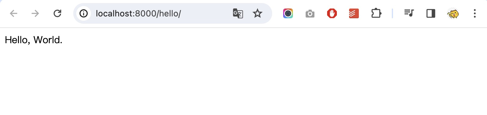

```
Docker 的三大功用：
1. 簡化部署流程
2. 跨平台部署
3. 建立乾淨測試環境
```

# 功用一：簡化部署流程

## 觀念解說
如果沒有使用 Docker，當你需要將應用程式部署到多台伺服器上時，必須逐一輸入指令進行設定。這不僅在環境安裝階段耗費大量時間且枯燥乏味，還容易因人為失誤而輸入錯誤指令。更重要的是，若需要在不同環境中進行部署，還得應對各種環境變數和配置的複雜性。

Docker 的推出為我們提供了一套強大的容器化解決方案。

透過使用 Docker，我們能夠將應用程式及其相依的環境、套件等打包成一個獨立、可攜帶的容器。這樣一來，無論在何處都能確保應用程式以相同的方式運行，避免受到不同環境的影響。

這種容器化的方法使得應用程式的部署和管理變得更加靈活、簡便，同時提供了更高度的一致性和可攜性。

---
# 實作示範

## 建立一個映像檔（Docker Image）
Docker Image 就像是一個獨立、可攜帶的程式部署包，其中包含了應用程式（在這個範例中是 Django 網站）以及它所需要的環境、套件等資源，都被一併打包在一起。

### Start a Docker Container
```shell
$ docker pull python:3.12-alpine
$ docker run --name mysite -it -p 8000:8000 python:3.12-alpine /bin/sh
/ #
```

### Install packages in a Docker Container
```shell
/ # apk update
/ # apk add vim
/ # pip install django
```

### Create a Django website in a Docker Container
```shell
/     # cd /home/
/home # django-admin startproject mysite
/home # cd mysite/
/home/mysite # django-admin startapp app1
```

### Django Settings
- `mysite/settings.py`
	```python
	INSTALLED_APPS = [
        #...
        'app1',
	]
	```
- `mysite/urls.py`
	```python
	#...
	from django.urls import re_path as url
	from app1.views import hello_world

	urlpatterns = [
        #...
        url(r'^hello/$', hello_world),
	]
	```
- `app1/views.py`
	```python
	#...
	from django.http import HttpResponse

	def hello_world(request):
        return HttpResponse('Hello, World.')
	```

### Run a Django website in a Docker Container
```shell
/home/mysite # python manage.py runserver 0.0.0.0:8000
```

> Open your browser: [http://localhost:8000/hello/](http://localhost:8000/hello/)
> 

### Create a new image from a container's changes
```shell
$ docker container ls -a
CONTAINER ID   IMAGE                COMMAND     CREATED          STATUS                      PORTS     NAMES
dbd03d68bf0d   python:3.12-alpine   "/bin/sh"   32 minutes ago   Exited (0) 10 seconds ago             mysite

$ docker commit dbd03d68bf0d  django_site:v1

$ docker images
REPOSITORY    TAG           IMAGE ID       CREATED         SIZE
django_site   v1            5499518614d6   2 seconds ago   136MB
python        3.12-alpine   d2cfe5300063   5 weeks ago     56.4MB
```

## 部署一個 Django 網站

### Use a Docker Image to create a Docker Container
```shell
$ docker run --name mysite_002 -it -p 8000:8000 django_site:v1 /bin/sh
/ # cd home/mysite/
/home/mysite # python manage.py runserver 0.0.0.0:8000
```

> 哇！只要三行指令，就能把事先打包好的 Django 網站建立起來了～
> Open your browser: [http://localhost:8000/hello/](http://localhost:8000/hello/)
> PS. 後續還有更進階的部署作法，像是 Dockerfile、Docker Compose 喔！
